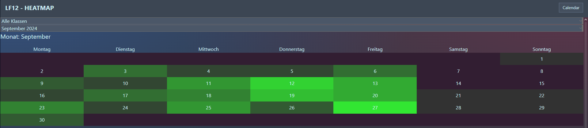
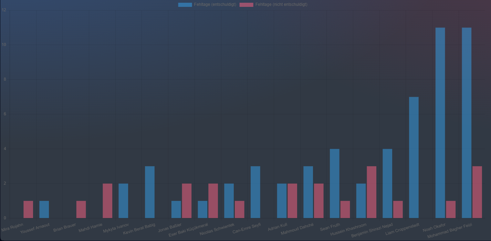

# Frontend - SvelteKit

> Leander

## Dependencies

Install the dependencies:

```bash
yarn
```

## Developing

Start the development server and view the site at http://localhost:1573/calendar.

```bash
yarn dev
```

## Showcase

### Calendar



### Chart

